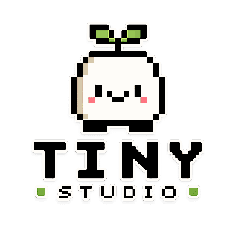

  
  

    <em>An indie game studio in your Claude Code terminal.</em>
  

A **Claude Code**-friendly (and **Cursor**-compatible) template for solo and tiny
teams who want AI help that feels like **three talented friends in a small
studio** — not a AAA corporation.

## What this is

- **`CLAUDE.md`** — master operating guide for the repo.
- **`.claude/agents/`** — exactly **three** agents: `game-developer`,
  `game-designer`, `game-artist`.
- **`.claude/skills/`** — **eight** slash workflows (`/start`, `/brainstorm`, …).
- **`.claude/docs/`** — short philosophy, collaboration, and QA-evidence notes.
- **`.claude/settings.json`** — starter permission hints you can extend.

There is **no** mandatory `src/`, engine, or engine-specific stack — add your game
where you like; the template stays lightweight.

## How this differs from huge “game studio” repos

[Claude-Code-Game-Studios](https://github.com/Donchitos/Claude-Code-Game-Studios)
(and similar) offer **dozens** of agents, **many** skills, hierarchy tiers,
hooks, and broad process. That can be powerful — it can also be **noise** for a
solo dev or jam team.

**Tiny Studio** keeps:

- **Three roles** you can hold in your head.
- **Eight commands** that cover the real loop: **orient → ideate → specify →
  build → look → review → QA → ship check**.
- **Peer critique**, not escalation charts — **you** stay the creative director.

## Who it is for

- Solo developers using AI for **design + code + art direction** conversations.
- Pairs or trios who want **shared vocabulary** without enterprise workflow.
- Anyone who liked the *idea* of a “game studio in a repo” but **not** the
  **scale** of the big templates.

## Quick start

1. Copy this folder or use it as a **GitHub template** (when published).
2. Open **Claude Code** in the project (or Cursor with project rules pointing here).
3. Run **`/start`** to detect state and write **`design/pillars.md`**.
4. Use **`/brainstorm`**, **`/design-feature`**, **`/implement-feature`** in
   that order when building something new.
5. Before you show a build: **`/qa`** and **`/ship-check`**.

### Slash commands (skills)

| Command              | Purpose                                      |
|----------------------|----------------------------------------------|
| `/start`             | Onboard: engine, pillars, feel, scope        |
| `/brainstorm`        | Shape concepts, verbs, emotional goals       |
| `/design-feature`    | Lean feature spec (designer-led)             |
| `/implement-feature` | Build in slices (developer-led)              |
| `/art-direction`     | Cohesion, palette, UI/motion rules           |
| `/playtest-review`   | All three perspectives on a slice or idea  |
| `/qa`                | Evidence-first quality pass                  |
| `/ship-check`        | Share/release readiness for the stated scope |

Names may appear with or without the slash depending on your client; skills live
under `.claude/skills/<name>/SKILL.md`.

### Invoking agents

Use your client’s **subagent** or **Task** flow with the markdown files in
`.claude/agents/`. Each file describes voice, ownership, and collaboration.

## Hooks

No hooks are required. Add **minimal** scripts under `.claude/hooks/` only if
they solve a **real** problem (e.g. your team wants a pre-commit lint). The
default template stays quiet.

## Customization

- Edit **`CLAUDE.md`** with your non-negotiables (platform, engine, tone).
- Tighten or loosen agent prompts in **`.claude/agents/`**.
- Add **one** skill at a time under **`.claude/skills/`** — keep the set small.

## Inspiration & contrast

This template was designed **after reviewing** [Claude-Code-Game-Studios](https://github.com/Donchitos/Claude-Code-Game-Studios): we keep the **good** (skills,
agents, `CLAUDE.md` spine) and **drop** the **scale** (49 agents, 72 skills,
deep hierarchy, heavy hooks). Same galaxy, **smaller ship**.

## License

MIT — see `LICENSE`.
