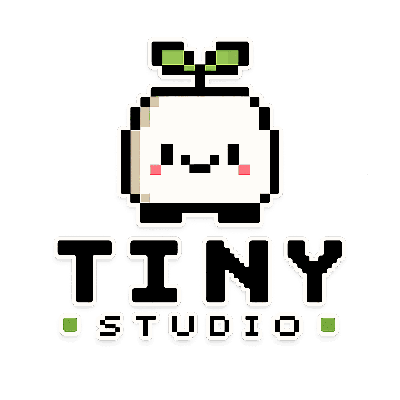

<div align="center">

<p align="center">

</p>

*An indie game studio in your terminal or editor.*

[](https://discord.gg/gaZ5XuPhz)

</div>

A **Claude Code**-, **Cursor**-, and **CLI**-friendly template for solo and tiny
teams who want AI help that feels like **three talented friends in a small
studio** — not a AAA corporation. Workflows live in **`.claude/skills/`**;
**Cursor** loads them through **`.cursor/skills`**, a **symlink** to that folder.
If the link is wrong after clone, or skills never appear in Cursor, see
**[TROUBLESHOOTING.md](TROUBLESHOOTING.md)** (common causes: **Windows** Git
checkout without symlinks, **OneDrive**, or missing **Developer Mode** /
elevated shell for `mklink`).

## Highlights

- **Three agents, many skills** — developer, designer, and artist. Each
  writes a spec file and stops. Workflows run from `/start` through
  `/vertical-slice`.
- **Client-flexible, engine-agnostic** — use **Claude Code**, **Cursor**, or
  **Codex CLI**; no required `src/` layout or engine stack in the template.
- **Optional vision MCP** — screen snapshots (`tiny-vision`) for playtest
  evidence. Audio, image, and mesh generation stay in an external tool.
- **Single source for skills** — edit **`.claude/skills/`** only; Cursor stays in
  sync via **`.cursor/skills`** when the symlink is intact
  ([TROUBLESHOOTING.md](TROUBLESHOOTING.md) if not).

## What this is

- **`CLAUDE.md`** — master operating guide for the repo.
- **`AGENTS.md`** — thin bootstrap for **Codex CLI** (and other tools that read
  `AGENTS.md`); full detail stays in **`CLAUDE.md`**.
- **`.claude/agents/`** — exactly **three** agents: `game-developer`,
  `game-designer`, `game-artist`.
- **`.claude/skills/`** — slash workflows (`/start`, `/brainstorm`, …).
- **`.cursor/skills`** — symlink to **`.claude/skills/`** so Cursor stays in sync
  (**Cursor only** — see [TROUBLESHOOTING.md](TROUBLESHOOTING.md)).
- **`.claude/docs/`** — philosophy, collaboration, QA-evidence, and optional
  MCP setup:
  - [vision-setup.md](.claude/docs/vision-setup.md) — `tiny-vision`
  - [external-assets.md](.claude/docs/external-assets.md) — slot metadata only
- **`.claude/settings.json`** — starter permission hints you can extend.

There is **no** mandatory `src/`, engine, or engine-specific stack — add your game
where you like; the template stays lightweight.

## Quick start

1. Copy this folder or use it as a **GitHub template** (when published).
2. Open the project in **Claude Code**, **Cursor**, or **Codex CLI**.
   - **Cursor:** project skills come from **`.cursor/skills`** → **`.claude/skills`**
     (verify the symlink in [TROUBLESHOOTING.md](TROUBLESHOOTING.md), especially on
     **Windows**).
   - **Codex CLI:** reads **`AGENTS.md`** → **`CLAUDE.md`** → skill files.
     Agent Skills live under `.agents/skills` ([docs](https://developers.openai.com/codex/skills)); copy or symlink `.claude/skills/<name>` there to reuse.
3. Run **`/start`** to write the **`design/gdd.md`** index and
   **`design/specs/mechanics.md`**.
4. When building gameplay: **`/brainstorm`**, **`/proof-of-fun`**,
   **`/design-feature`**, **`/implement-feature`** in that order.
5. Check the spec contract with **`npm run validate`**.
6. Before you show a build: **`/qa`** and **`/ship-check`**.

### Slash commands (skills)

| Command              | Purpose                                      |
|----------------------|----------------------------------------------|
| `/start`             | Index + mechanics; set studio mode           |
| `/brainstorm`        | Shape concepts, verbs, emotional goals       |
| `/proof-of-fun`      | 30-second slice; human go / no-go            |
| `/design-feature`    | Lean feature spec (one role per turn)        |
| `/implement-feature` | Build in slices (developer-led)              |
| `/art-direction`     | Write `design/specs/art_style.md`            |
| `/playtest-review`   | One role appends a review note, then stops   |
| `/qa`                | Evidence-first quality pass                  |
| `/ship-check`        | Share/release readiness for the stated scope |
| `/gen-gdd`           | Deepen one spec file, then stop              |
| `/vertical-slice`    | Specs → implement → `/qa`                    |

Names may appear with or without the slash depending on your client. Skill files:
**`.claude/skills/<name>/SKILL.md`**.

### Optional MCP

Vision is **optional**. Skills work without it.

#### Vision — `tiny-vision`

Screen snapshots for playtest evidence. See
**[.claude/docs/vision-setup.md](.claude/docs/vision-setup.md)**.

```powershell
pip install -r requirements-vision.txt
# Cursor MCP: python -m core.vision.mcp_server  (cwd = repo root)
```

#### Assets

This repo does not generate audio, images, or meshes. Slot metadata lives
in **`design/specs/asset_hooks.json`**. Attach an external tool such as
Mason in your client when you want binaries. See
**[.claude/docs/external-assets.md](.claude/docs/external-assets.md)**.

#### Spec check

```powershell
npm install
npm run validate
```

`studio.config.json` holds studio mode, turn budgets, and artifact paths.
No API keys.

### Invoking agents

Use your client’s **subagent** or **Task** flow with the markdown files in
`.claude/agents/`. Each file describes voice, ownership, and collaboration.

## Who it is for

- Solo developers using AI for **design + code + art direction** conversations.
- Pairs or trios who want **shared vocabulary** without enterprise workflow.
- Anyone who liked the *idea* of a “game studio in a repo” but **not** the
  **scale** of the big templates.

## Hooks

No hooks are required. Add **minimal** scripts under `.claude/hooks/` only if
they solve a **real** problem (e.g. your team wants a pre-commit lint). The
default template stays quiet.

## Customization

- Keep **`AGENTS.md`** short; put durable studio rules in **`CLAUDE.md`**.
- Edit **`CLAUDE.md`** with your non-negotiables (platform, engine, tone).
- Tighten or loosen agent prompts in **`.claude/agents/`**.
- Add **one** skill at a time under **`.claude/skills/`** — keep the set small.

## License

MIT — see `LICENSE`.
